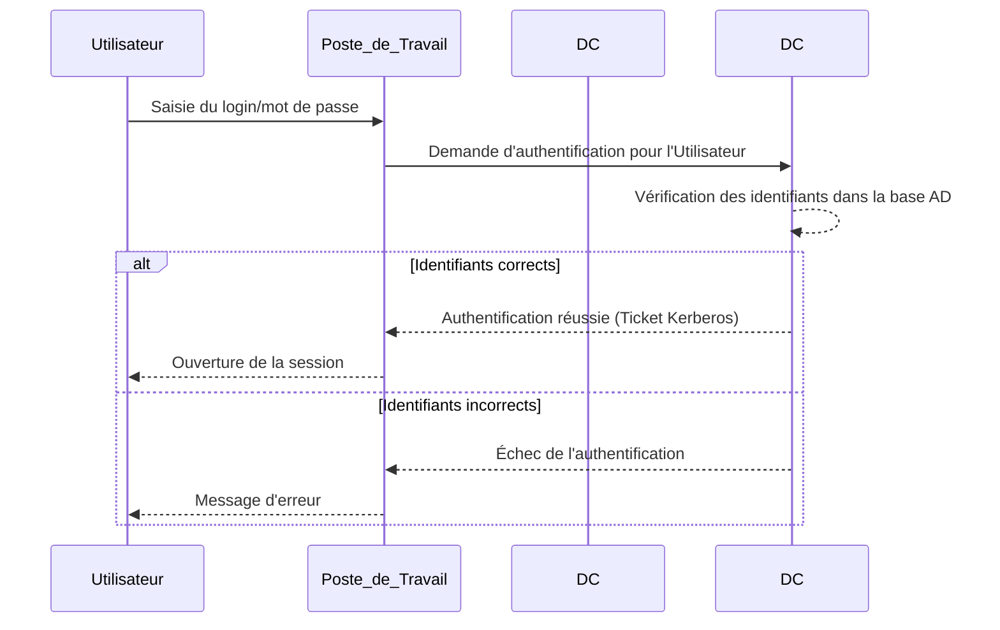

# [span_0](start_span)Le Royaume Active Directory - De Novice à Gardien des Clés[span_0](end_span)

## Introduction : Bienvenue dans le Royaume Numérique

[span_1](start_span)Ce rapport vous invite à un voyage.[span_1](end_span) Nous n'allons pas simplement étudier un logiciel ; nous allons explorer un royaume numérique. [span_2](start_span)Active Directory (AD) est ce royaume.[span_2](end_span) Vous, futur administrateur, en êtes le gardien. [span_3](start_span)Les utilisateurs sont les citoyens, les ordinateurs sont les habitations et les forteresses, les données sont les trésors et les secrets d'État.[span_3](end_span) [span_4](start_span)Les attaquants sont les espions, les assassins et les armées ennemies qui cherchent à s'emparer des "clés du royaume".[span_4](end_span) [span_5](start_span)Active Directory n'est pas un simple annuaire ; c'est la pierre angulaire de l'infrastructure informatique pour 90 % des entreprises mondiales.[span_5](end_span) [span_6](start_span)Il centralise la gestion de l'identité et l'authentification des utilisateurs et des ressources.[span_6](end_span) Si Active Directory ne fonctionne pas, l'entreprise s'arrête. [span_7](start_span)Comprendre sa structure est important, mais maîtriser sa sécurité est une responsabilité absolue.[span_7](end_span) [span_8](start_span)Ce guide est conçu pour vous faire passer de simple visiteur à gardien expert de ce royaume vital, en décomposant sa complexité en briques compréhensibles et en mettant un accent constant sur l'art de sa défense.[span_8](end_span)

## [span_9](start_span)Partie I : Cartographier le Royaume - Les Structures Fondamentales d'Active Directory[span_9](end_span)

[span_10](start_span)La manière dont un royaume est organisé, avec ses provinces, ses cités et ses frontières, détermine sa capacité à se défendre et à prospérer.[span_10](end_span) Il en va de même pour Active Directory. [span_11](start_span)La manière dont vous structurez votre environnement en domaines, arbres et forêts n'est pas une simple question de rangement.[span_11](end_span) [span_12](start_span)C'est la première et l'une des plus fondamentales décisions de sécurité que vous prendrez.[span_12](end_span) Une forêt est la frontière de sécurité ultime. [span_13](start_span)Un domaine est une frontière administrative et de réplication.[span_13](end_span) [span_14](start_span)Une conception mal avisée de cette structure peut introduire des failles de sécurité systémiques avant même la création du premier utilisateur.[span_14](end_span) [span_15](start_span)Chaque choix architectural a des implications profondes sur la manière dont les permissions sont gérées et dont les attaques peuvent être contenues ou, au contraire, se propager.[span_15](end_span)

### [span_16](start_span)Chapitre 1 : Le Domaine - La Capitale du Royaume[span_16](end_span)

**Le Service d'Annuaire : La Grande Bibliothèque du Royaume**

[span_17](start_span)Au cœur de tout royaume se trouve un registre central de ses habitants, de ses terres et de ses lois.[span_17](end_span) Active Directory est, avant tout, un service d'annuaire. [span_18](start_span)Imaginez une bibliothèque gigantesque qui ne contient pas de livres, mais des fiches détaillées sur chaque "objet" du royaume : chaque citoyen (compte utilisateur), chaque chariot (compte ordinateur), chaque guilde (groupe), et même chaque imprimante.[span_18](end_span) [span_19](start_span)Cet annuaire centralisé permet aux administrateurs de gérer, d'organiser et de sécuriser toutes les ressources du réseau à partir d'un seul endroit, éliminant le chaos de la gestion individuelle de chaque machine.[span_19](end_span)

**[span_20](start_span)Le Domaine : La Cité-État**[span_20](end_span)

[span_21](start_span)Un domaine est un groupe logique d'objets (utilisateurs, ordinateurs, etc.) qui partagent la même base de données d'annuaire et sont soumis à un ensemble commun de règles.[span_21](end_span) C'est la capitale de votre territoire, une cité-état administrative. [span_22](start_span)Par exemple, tous les citoyens et ressources de Ventes.MonRoyaume.com appartiennent à ce domaine.[span_22](end_span) [span_23](start_span)Il définit une frontière administrative claire : les lois (stratégies) et les administrateurs de ce domaine gèrent tout ce qui s'y trouve, et leurs pouvoirs s'arrêtent aux frontières du domaine.[span_23](end_span)

**[span_24](start_span)Le Contrôleur de Domaine (DC) : Le Château Fort**[span_24](end_span)

[span_25](start_span)Si le domaine est la capitale, le Contrôleur de Domaine (DC) est son château fort.[span_25](end_span) [span_26](start_span)Le DC est un serveur Windows qui héberge et protège la "grande bibliothèque" (la base de données Active Directory, ntds.dit).[span_26](end_span) [span_27](start_span)C'est le cœur battant du domaine, et son rôle est double et critique :[span_27](end_span)

* **[span_28](start_span)Authentification :** Il agit comme le garde à l'entrée du château.[span_28](end_span) [span_29](start_span)Quand un utilisateur tente de se connecter à son poste de travail, c'est le DC qui vérifie son identité en comparant le nom d'utilisateur et le mot de passe fournis avec les informations stockées dans sa base de données.[span_29](end_span)
* **[span_30](start_span)Autorisation :** Une fois l'utilisateur authentifié, le DC informe les autres services du réseau de ce que cet utilisateur a le droit de faire, en se basant sur ses permissions et ses appartenances à des groupes.[span_30](end_span)

[span_31](start_span)Pour garantir la résilience du royaume et éviter qu'il ne s'effondre si un château est assiégé (si un DC tombe en panne), il est crucial d'avoir au moins deux Contrôleurs de Domaine par domaine.[span_31](end_span) [span_32](start_span)Ces DC se répliquent constamment les informations entre eux grâce à un mécanisme de réplication multi-maître, où une modification sur un DC est automatiquement propagée aux autres.[span_32](end_span)

Chapitre 2 : L'Arbre et la Forêt - Alliances et Empires
L'Arbre : Une Dynastie de Domaines
[cite_start]Un royaume peut s'étendre et donner naissance à de nouvelles provinces. [cite: 30] [cite_start]Dans Active Directory, un arbre est une collection d'un ou plusieurs domaines qui partagent un espace de nom DNS contigu et hiérarchique. [cite: 30]
 * [cite_start]Métaphore : Si MonRoyaume.com est le domaine parent (le roi fondateur), alors Ventes.MonRoyaume.com et RH.MonRoyaume.com sont des domaines enfants. [cite: 31] [cite_start]Ils sont issus de la même lignée et forment ensemble une seule dynastie, un seul "arbre". [cite: 32] [cite_start]Une relation de confiance bidirectionnelle et transitive est automatiquement établie entre le parent et l'enfant, facilitant le partage de ressources. [cite: 33] [cite_start]Cette structure est souvent utilisée pour refléter l'organisation géographique ou départementale d'une grande entreprise. [cite: 34]
[cite_start]La Forêt : La Frontière Ultime de l'Empire [cite: 35]
[cite_start]La forêt est le conteneur de plus haut niveau dans la structure logique d'Active Directory. [cite: 35] [cite_start]C'est un ensemble d'un ou plusieurs arbres qui ne partagent pas nécessairement le même espace de nom. [cite: 36]
 * [cite_start]Métaphore : Notre empire (MonRoyaume.com) peut former une alliance stratégique avec un autre royaume acquis par mariage ou conquête (RoyaumeAcquis.net). [cite: 37] [cite_start]Les deux arbres (MonRoyaume.com et RoyaumeAcquis.net) coexistent alors dans la même "forêt". [cite: 38]
 * [cite_start]Importance Critique de la Forêt : La forêt est la frontière de sécurité. [cite: 39] [cite_start]C'est le périmètre le plus large au sein duquel les accès peuvent être gérés. [cite: 40] [cite_start]Tous les domaines d'une même forêt partagent deux éléments fondamentaux : [cite: 41]
   * [cite_start]Un Schéma Commun : Le plan de construction qui définit ce qu'est un "objet" (quels attributs un utilisateur peut avoir, par exemple) est identique pour toute la forêt. [cite: 41]
   * [cite_start]Un Catalogue Global (Global Catalog) : Un index partiel contenant les informations les plus importantes sur chaque objet de la forêt, permettant des recherches rapides à travers tous les domaines. [cite: 42]
[cite_start]Une relation de confiance bidirectionnelle et transitive est automatiquement établie entre tous les domaines de la forêt. [cite: 43] [cite_start]Cela signifie qu'un compte du domaine Ventes.MonRoyaume.com peut potentiellement accéder à une ressource dans Prod.RoyaumeAcquis.net si les permissions appropriées sont accordées. [cite: 44] [cite_start]La décision de créer une ou plusieurs forêts est donc une décision de sécurité majeure qui définit le niveau d'isolation entre les différentes entités d'une organisation. [cite: 45]
graph TD
    subgraph Forêt
        subgraph Arbre1
            A(MonRoyaume.com - Racine) --> B(Ventes.MonRoyaume.com)
            A --> C(RH.MonRoyaume.com)
        end
        subgraph Arbre2
            D(RoyaumeAcquis.net - Racine) --> E(Prod.RoyaumeAcquis.net)
        end
       A <-->|Relation de confiance transitive| D
    end

Partie II : Les Habitants et les Lois du Royaume - Objets et Politiques
[cite_start]Une fois la carte du royaume établie, il est temps de s'intéresser à ses habitants et aux lois qui les régissent. [cite: 47] [cite_start]Dans Active Directory, la manière dont les objets sont créés, groupés et gérés, ainsi que la façon dont les politiques (GPO) sont appliquées, définit directement la surface d'attaque. [cite: 48] [cite_start]Une structure d'Unités d'Organisation (OU) désorganisée , un abus des groupes de sécurité, ou une mauvaise application des GPO ne sont pas de simples problèmes de "propreté" administrative ; [cite: 49] ce sont des vulnérabilités actives. [cite_start]La délégation de contrôle, si elle n'est pas effectuée avec une précision chirurgicale, peut créer des chemins d'escalade de privilèges involontaires. [cite: 50] [cite_start]La gestion des objets et des politiques est donc le prélude indispensable à une sécurité robuste. [cite: 51]
[cite_start]Chapitre 3 : Les Habitants du Royaume - Objets AD [cite: 52]
[cite_start]L'annuaire Active Directory est peuplé d'objets, qui sont les entités représentant les ressources du réseau. [cite: 52] [cite_start]Ces objets se divisent en deux grandes catégories. [cite: 53]
 * [cite_start]Objets Feuilles (Leaf Objects) : Ce sont les objets finaux, comme les citoyens et leurs biens. [cite: 53] Ils ne peuvent pas contenir d'autres objets. [cite_start]Les exemples les plus courants sont les comptes d'Utilisateurs, les comptes d'Ordinateurs et les objets Imprimantes. [cite: 54]
 * [cite_start]Objets Conteneurs (Container Objects) : Ce sont des objets qui peuvent en contenir d'autres, servant à organiser la structure. [cite: 55] [cite_start]Les exemples incluent les Domaines, les Unités d'Organisation (OU) et les Groupes. [cite: 56]
[cite_start]L'Unité d'Organisation (OU) : Les Ministères et Provinces [cite: 57]
[cite_start]L'Unité d'Organisation (OU) est le conteneur le plus important et le plus flexible pour l'administration quotidienne. [cite: 57]
 * [cite_start]Métaphore : Pensez aux OU comme aux ministères (Ventes, Finance, R&D) ou aux provinces (Paris, Lyon) de votre royaume. [cite: 58] [cite_start]Elles vous permettent de regrouper des objets (principalement des utilisateurs et des ordinateurs) de manière logique pour refléter la structure de votre organisation. [cite: 59]
 * [cite_start]Rôle Fondamental : La puissance des OU réside dans leur double fonction. [cite: 60] [cite_start]Contrairement aux conteneurs par défaut comme "Users" ou "Computers", vous POUVEZ et DEVEZ utiliser les OU pour deux tâches critiques : [cite: 61]
   * [cite_start]Lier des Stratégies de Groupe (GPO) : Pour appliquer des configurations spécifiques à un ensemble d'utilisateurs ou d'ordinateurs. [cite: 61]
   * [cite_start]Déléguer des droits administratifs : Pour donner des permissions de gestion limitées à des équipes spécifiques. [cite: 62]
[cite_start]Les Groupes : Les Guildes et Confréries [cite: 63]
[cite_start]Les groupes sont des collections d'objets (utilisateurs, ordinateurs, ou même d'autres groupes) principalement utilisés pour gérer les permissions et les communications de manière efficace. [cite: 63] [cite_start]Il est crucial de comprendre la différence entre les deux types principaux. [cite: 64]
[cite_start]Groupes de Sécurité : [cite: 65]
 * [cite_start]Métaphore : Ce sont les détenteurs de clés du royaume. [cite: 65] [cite_start]Au lieu de donner une clé individuelle pour la salle du trésor à chaque membre de la garde royale, vous donnez une seule clé au "Groupe de la Garde Royale". [cite: 66] [cite_start]Toute personne qui rejoint ce groupe peut utiliser cette clé. [cite: 67]
 * [cite_start]Fonction : Leur but principal est d'assigner des permissions d'accès à des ressources partagées (fichiers, dossiers, imprimantes). [cite: 68] [cite_start]Pour ce faire, ils possèdent un identifiant de sécurité unique (SID) et peuvent être ajoutés aux Listes de Contrôle d'Accès (ACL) des ressources. [cite: 69] [cite_start]Ils peuvent également être utilisés comme liste de distribution d'e-mails. [cite: 70]
[cite_start]Groupes de Distribution : [cite: 71]
 * [cite_start]Métaphore : Ce sont des listes de diffusion pour les messagers du roi, permettant d'envoyer un décret à tous les nobles d'un coup. [cite: 71]
 * [cite_start]Fonction : Leur seul et unique but est de créer des listes d'adresses e-mail (par exemple, touslesemployes@monroyaume.com) pour faciliter la communication. [cite: 72] [cite_start]Ils ne sont pas "activés pour la sécurité", ce qui signifie qu'ils n'ont pas de SID et ne peuvent PAS être utilisés pour accorder des permissions. [cite: 73]
[cite_start]Le choix entre ces deux types de groupes est une décision de gestion fondamentale. [cite: 74] [cite_start]L'utilisation de groupes de sécurité est la norme pour la gestion des accès, tandis que les groupes de distribution sont réservés à la communication. [cite: 75]
| Caractéristique | Groupe de Sécurité | Groupe de Distribution |
|---|---|---|
| Objectif Principal | Gérer les permissions et les accès aux ressources | Créer des listes d'e-mails pour la communication |
| Peut recevoir des permissions? | Oui (possède un SID, peut être dans une ACL) | Non (n'est pas un principal de sécurité) |
| Peut être utilisé pour envoyer des e-mails? | Oui | Oui |
| Cas d'usage typique | Donner l'accès au dossier "Comptabilité" | Envoyer une newsletter à toute l'entreprise |
| Considération de performance | Un trop grand nombre d'appartenances peut ralentir la connexion de l'utilisateur | Aucun impact sur la performance de connexion |
[cite_start]Chapitre 4 : La Délégation de Contrôle - Nommer des Gouverneurs Locaux [cite: 77]
[cite_start]Il est à la fois dangereux et inefficace que seuls les "Admins du Domaine" (les conseillers les plus proches du roi) puissent tout faire dans le royaume. [cite: 77] [cite_start]La délégation de contrôle est le mécanisme qui permet de confier des tâches administratives spécifiques sur des périmètres limités (généralement des OU) à d'autres utilisateurs ou groupes. [cite: 78]
 * [cite_start]Métaphore : Le roi nomme un gouverneur pour la province de "Lyon". [cite: 79] [cite_start]Ce gouverneur (par exemple, le groupe "Support Technique Lyon") reçoit le droit de gérer les citoyens (réinitialiser les mots de passe des utilisateurs) et les habitations (ajouter des ordinateurs au domaine) de sa province uniquement. [cite: 80] [cite_start]Il n'a aucun pouvoir sur la province de "Paris" ou sur les affaires du royaume. [cite: 81]
Comment ça marche?
[cite_start]L'outil principal pour cela est l'Assistant de Délégation de Contrôle, accessible par un clic droit sur une OU. [cite: 82] [cite_start]Un administrateur peut y accorder des permissions granulaires prédéfinies, comme "Réinitialiser les mots de passe des comptes d'utilisateur" ou "Gérer l'appartenance des groupes", à un utilisateur ou à un groupe spécifique. [cite: 83]
 * [cite_start]Focus Sécurité : La délégation est un outil puissant pour appliquer le principe du moindre privilège, mais elle doit être maniée avec une extrême prudence. [cite: 84] [cite_start]Une délégation mal configurée (par exemple, donner des droits sur une OU parente qui se propagent par héritage à des OU critiques contenant des serveurs ou des administrateurs) peut créer des failles de sécurité béantes. [cite: 85] [cite_start]Il est impératif de ne jamais déléguer de contrôle sur les conteneurs par défaut (comme "Users") ou sur l'OU des contrôleurs de domaine. [cite: 86]
<!-- end list -->
graph TD
    A("Admin du Domaine") --"Délègue la tâche via l'Assistant"--> B(OU 'Ventes')
    subgraph B
        C[Utilisateur 'Jean Vente']
        D[Ordinateur 'PC-Jean']
    end
    F("Groupe 'Support Ventes'") --"Reçoit la permission sur OU 'Ventes'"--> B
    F --"Peut maintenant réinitialiser le mot de passe de"--> C
    F -.->|N'a aucun droit sur| G(OU 'Finance')

Chapitre 5 : Les Stratégies de Groupe (GPO) - Le Code de Lois du Royaume
[cite_start]Les Objets de Stratégie de Groupe (GPO) sont le principal mécanisme pour définir, déployer et imposer des règles et des configurations de manière centralisée sur un grand nombre d'utilisateurs et d'ordinateurs. [cite: 88]
 * [cite_start]Métaphore : Les GPO sont le code de lois du royaume. [cite: 89] [cite_start]Une loi peut dire "Tous les citoyens du royaume doivent avoir un mot de passe d'au moins 10 caractères" (une GPO liée au domaine) ou "Dans la province des 'Ventes', le fond d'écran des ordinateurs doit être le logo de l'entreprise" (une GPO liée à l'OU 'Ventes'). [cite: 90]
 * [cite_start]Ce qu'on peut faire avec les GPO : La portée des GPO est immense. [cite: 91] [cite_start]Elles permettent de déployer des logiciels (via des paquets MSI), de mapper des lecteurs réseau et des imprimantes, de configurer des centaines de paramètres de sécurité (règles de pare-feu, restrictions sur les ports USB, politique d'audit), de définir des fonds d'écran, de restreindre l'accès à des parties du système d'exploitation comme l'invite de commande, et bien plus encore. [cite: 92]
 * [cite_start]L'Ordre d'Application (LSDOU) : C'est un concept fondamental pour comprendre et dépanner les GPO. [cite: 93] [cite_start]Les politiques s'appliquent dans un ordre de précédence strict, chaque niveau pouvant écraser le précédent : [cite: 94]
   * [cite_start]Local : D'abord, la politique de la machine locale elle-même. [cite: 94]
   * [cite_start]Site : Ensuite, la politique liée au site Active Directory (un regroupement d'objets basé sur la topologie réseau physique). [cite: 95]
   * [cite_start]Domaine : Puis, la ou les politiques liées au domaine. [cite: 96]
   * [cite_start]OU (Unité d'Organisation) : Enfin, les politiques liées aux Unités d'Organisation, en commençant par l'OU la plus haute dans la hiérarchie et en descendant jusqu'à l'OU qui contient l'objet. [cite: 97]
 * [cite_start]La Règle d'Or : La politique la plus proche de l'objet l'emporte. [cite: 98] [cite_start]Si une GPO au niveau du domaine désactive l'invite de commande, mais qu'une GPO sur l'OU de l'utilisateur l'active, l'utilisateur AURA accès à l'invite de commande. [cite: 99] [cite_start]Cette règle garantit une
